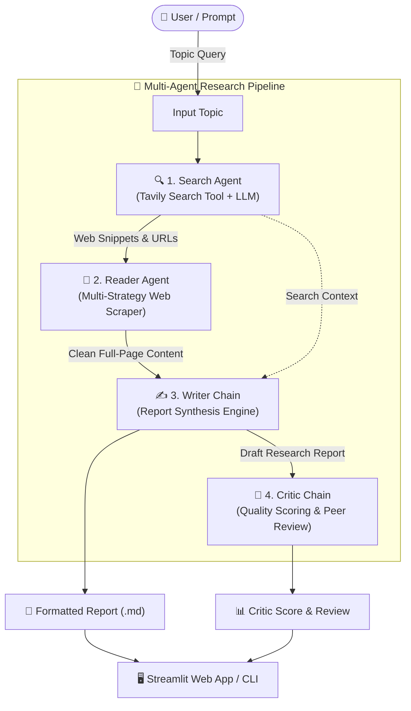

# 🔬 Multi-Agent Research System (ResearcherAgent)

[](https://www.python.org/)
[](https://python.langchain.com/)
[](https://groq.com/)
[](https://tavily.com/)
[](https://streamlit.io/)
[](https://opensource.org/licenses/MIT)

An autonomous, multi-agent AI research ecosystem that coordinates specialized agents to search the web, extract in-depth webpage content, draft comprehensive structured research reports, and perform critical peer-review evaluations on any given topic.

---

## 📑 Table of Contents

- [Overview](#-overview)
- [Key Features](#-key-features)
- [System Architecture](#-system-architecture)
- [Technology Stack](#-technology-stack)
- [Agent Workflow](#-agent-workflow)
- [Demo & UI Preview](#-demo--ui-preview)
- [Project Directory Structure](#-project-directory-structure)
- [Getting Started & Setup](#-getting-started--setup)
  - [Prerequisites](#prerequisites)
  - [Installation](#installation)
  - [Environment Configuration](#environment-configuration)
- [Running the Application](#-running-the-application)
  - [1. Interactive Web Dashboard (Streamlit)](#1-interactive-web-dashboard-streamlit)
  - [2. CLI / Programmatic Pipeline](#2-cli--programmatic-pipeline)
- [Sample Output & Demo Preview](#-sample-output--demo-preview)
- [Contributing](#-contributing)
- [License](#-license)

---

## 🌟 Overview

Conducting thorough web research manually requires discovering relevant sources, filtering noise, reading long articles, synthesizing key insights into structured reports, and auditing the factual accuracy of the results.

**ResearcherAgent** solves this by establishing a collaborative multi-agent pipeline powered by **LangChain** and ultra-fast inference via **Groq**:
1. **Search Agent**: Scours the live web using Tavily for high-credibility articles and recent information.
2. **Reader Agent**: Autonomously inspects search results, selects the highest-value URLs, and performs clean, full-text extraction with a 3-tier scraping fallback mechanism.
3. **Writer Chain**: Synthesizes multi-source raw research into a structured, executive-level markdown report.
4. **Critic Chain**: Evaluates the drafted report against strict quality benchmarks, providing a numerical score (out of 10), breakdown of strengths, areas to improve, and final verdict.

---

## ✨ Key Features

- **🤖 Multi-Agent Collaboration**: Segregation of duties across dedicated agents and prompt chains.
- **⚡ Ultra-Fast LLM Inference**: Powered by **Groq** for high-throughput responses.
- **🌐 Real-Time Web Intelligence**: Integration with **Tavily AI Search** for clean, real-time results.
- **🛡️ 3-Tier Resilient Web Scraping Engine**:
  - *Tier 1*: `trafilatura` for primary article extraction.
  - *Tier 2*: `readability-lxml` + `BeautifulSoup4` for structured document body cleaning.
  - *Tier 3*: Fallback full DOM text sanitizer with automated noise/tag decomposition.
- **🎨 Glassmorphic Streamlit Dashboard**: Dark-mode UI with live animated step cards, collapsible raw outputs, structured report viewers, and 1-click Markdown download.
- **💻 Dual Execution Modes**: Run via an interactive Web GUI (`app.py`) or headless via Python CLI (`main.py`).

---

## 🏗️ System Architecture



---

## 🛠️ Technology Stack

| Category | Technology / Library | Purpose |
|---|---|---|
| **Language** | Python 3.10+ | Core programming language |
| **Agent Orchestration** | [LangChain](https://github.com/langchain-ai/langchain) | Agent definitions, tool binding, prompts, and LCEL chains |
| **LLM Inference** | [Groq](https://groq.com/) (`langchain-groq`) | High-speed LLM model execution (e.g. `openai/gpt-oss-120b`) |
| **Search Engine** | [Tavily Search API](https://tavily.com/) | Real-time web retrieval engineered specifically for AI agents |
| **Scraping & Parsing** | `trafilatura`, `readability-lxml`, `bs4`, `lxml`, `requests` | Multi-strategy robust web scraping and text sanitization |
| **User Interface** | [Streamlit](https://streamlit.io/) | Interactive real-time pipeline monitoring and report viewer |
| **Environment & Logging**| `python-dotenv`, `rich` | Secure credentials management and console output formatting |

---

## 🤖 Agent Workflow

```
[User Input: Topic]
       │
       ▼
┌─────────────────────────────────────────────────────────────┐
│ 1. Search Agent                                            │
│    • Executes search via Tavily API                         │
│    • Returns ranked URLs, titles, and snippet context       │
└──────────────────────────────┬──────────────────────────────┘
                               │
                               ▼
┌─────────────────────────────────────────────────────────────┐
│ 2. Reader Agent                                            │
│    • Analyzes top URLs and chooses the best source          │
│    • Fetches & sanitizes deep webpage text                  │
└──────────────────────────────┬──────────────────────────────┘
                               │
                               ▼
┌─────────────────────────────────────────────────────────────┐
│ 3. Writer Chain                                            │
│    • Integrates search data + scraped content               │
│    • Synthesizes: Intro, Key Findings, Conclusion, Sources  │
└──────────────────────────────┬──────────────────────────────┘
                               │
                               ▼
┌─────────────────────────────────────────────────────────────┐
│ 4. Critic Chain                                            │
│    • Evaluates clarity, depth, and sourcing                 │
│    • Emits Score (X/10), Strengths, Improvements, Verdict   │
└─────────────────────────────────────────────────────────────┘
```

---

## 📸 Demo & UI Preview

### Web Application Features
1. **Interactive Topic Search**: Enter custom topics or pick from one-click curated suggestion chips.
2. **Live Agent Status Indicators**: Watch each agent transition dynamically (`WAITING` ➔ `● RUNNING` ➔ `✓ DONE`).
3. **Collapsible Raw Inspector**: Inspect intermediate outputs generated by the Search and Reader agents.
4. **Structured Markdown Report**: Beautifully rendered final report with export functionality (`.md` download).
5. **Score & Feedback Panel**: Color-coded critic evaluation with action items.

```
┌──────────────────────────────────────────────────────────────────────────┐
│  🔬 RESEARCHER AGENT                                                    │
│  Four specialized AI agents collaborate to deliver polished research     │
├──────────────────────────────────────┬───────────────────────────────────┤
│  Research Topic:                     │  Pipeline                         │
│  [ Future of LLM in Tech Industry ]  │  [01] Search Agent      ✓ DONE    │
│  [ ⚡ Run Research Pipeline ]        │  [02] Reader Agent      ✓ DONE    │
│                                      │  [03] Writer Chain      ✓ DONE    │
│  TRY → [AGI Roadmap] [AI Agents]    │  [04] Critic Chain      ✓ DONE    │
├──────────────────────────────────────┴───────────────────────────────────┤
│  📝 Final Research Report                                                │
│  # Research Report: Future of LLM in Tech Industry                       │
│  ## Introduction ...                                                     │
│  ## Key Findings (1, 2, 3) ...                                           │
│  ## Conclusion & Sources ...                                             │
│  [ ⬇ Download Report (.md) ]                                             │
├──────────────────────────────────────────────────────────────────────────┤
│  🧐 Critic Feedback                                                      │
│  Score: 9/10 | Strengths: Well sourced | Areas to Improve: Add benchmarks│
└──────────────────────────────────────────────────────────────────────────┘
```

---

## 📁 Project Directory Structure

```plaintext
Multi AI agent/
├── .env.example               # Template for required environment variables
├── .gitignore                 # Git ignore file for secrets and temp files
├── README.md                  # Project documentation & guide
├── requirements.txt           # Python dependencies
├── app.py                     # Streamlit web application & UI dashboard
├── main.py                    # CLI entry point to run the research pipeline
└── src/
    ├── __init__.py
    ├── agents/
    │   ├── __init__.py
    │   └── agents.py          # Search Agent, Reader Agent, Writer & Critic chains
    ├── pipeline/
    │   ├── __init__.py
    │   └── pipeline.py        # End-to-end multi-agent orchestration pipeline
    └── tools/
        ├── __init__.py
        └── tools.py           # Tavily Web Search and Multi-tier Web Scraper tools
```

---

## 🚀 Getting Started & Setup

### Prerequisites

- **Python 3.10+** installed on your system.
- API Key from [Groq Console](https://console.groq.com/) *(for fast LLM inference)*.
- API Key from [Tavily AI](https://tavily.com/) *(for web search retrieval)*.

---

### Installation

1. **Clone the repository**:
   ```bash
   git clone https://github.com/SuisideSpirit/Langchain-Multi-Agent-Research-System.git
   cd Langchain-Multi-Agent-Research-System
   ```

2. **Create and activate a virtual environment**:
   - **On Windows (PowerShell)**:
     ```powershell
     python -m venv venv
     .\venv\Scripts\Activate.ps1
     ```
   - **On macOS/Linux**:
     ```bash
     python3 -m venv venv
     source venv/bin/activate
     ```

3. **Install dependencies**:
   ```bash
   pip install --upgrade pip
   pip install -r requirements.txt
   ```

---

### Environment Configuration

Create a `.env` file in the root directory by copying the provided `.env.example`:

```bash
cp .env.example .env
```

Open `.env` and fill in your API credentials:

```env
# Groq API Key (Get from https://console.groq.com/)
GROQ_API_KEY="your_groq_api_key_here"

# Tavily Search API Key (Get from https://tavily.com/)
TAVILY_API_KEY="your_tavily_api_key_here"
```

---

## 💻 Running the Application

### 1. Interactive Web Dashboard (Streamlit)

Launch the modern glassmorphic Streamlit interface:

```bash
streamlit run app.py
```

Once running, navigate to `http://localhost:8501` in your browser.

### 2. CLI / Programmatic Pipeline

To execute the research pipeline directly from the terminal or embed it into external workflows:

```bash
python main.py
```

Or invoke it inside your own Python code:

```python
from src.pipeline.pipeline import run_reasearch_pipeline

# Run on any topic
results = run_reasearch_pipeline(topic="Quantum Computing breakthroughs in 2026")

# Access state outputs
print("Report:", results["report"])
print("Feedback:", results["feedback"])
```

---

## 📋 Sample Output & Demo Preview

<details>
<summary><b>🔍 Example Generated Research Report (Click to expand)</b></summary>

```markdown
# Comprehensive Report: Impact of AI on Tech Jobs

## Introduction
The rapid advancement of artificial intelligence (AI), particularly generative models and agentic workflows, is fundamentally reshaping the technology employment landscape. This report synthesizes key findings from recent industry studies, hiring trends, and technological shifts.

## Key Findings
1. **Transformation Over Replacement**: While routine coding and boilerplate tasks are increasingly automated, demand for systems architects, AI engineers, and prompt evaluation specialists has grown by over 40%.
2. **Productivity Multipliers**: Developers leveraging AI pair-programming tools report up to 55% faster turnaround on code implementation, shifting developer responsibility toward validation, architecture, and security.
3. **Emergence of New Disciplines**: New engineering roles such as AI Alignment Engineer, Context Window Optimization Specialist, and Autonomous Agent Orchestrator are becoming standard tech team positions.

## Conclusion
Rather than causing outright job scarcity, AI is altering the core skill matrix required for technology careers. Upskilling in agent orchestration, model supervision, and prompt engineering represents the highest ROI for tech professionals.

## Sources
- https://example.com/ai-tech-jobs-report-2026
- https://example.com/generative-ai-workforce-trends
```
</details>

<details>
<summary><b>🧐 Example Critic Evaluation (Click to expand)</b></summary>

```plaintext
Score: 9/10

Strengths:
- Clear structure with actionable insights and strong thematic focus.
- Accurate distinction between full automation and developer productivity augmentation.
- Well-formatted source attribution and professional tone.

Areas to Improve:
- Include specific salary and compensation metrics for emerging AI roles.
- Provide geographical breakdown of AI adoption in tech hubs.

One line verdict:
An insightful and well-balanced synthesis that accurately depicts the contemporary AI workforce transition.
```
</details>

---

## 🤝 Contributing

Contributions, issues, and feature requests are welcome!

1. Fork the repository
2. Create your Feature Branch (`git checkout -b feature/AmazingFeature`)
3. Commit your changes (`git commit -m 'Add some AmazingFeature'`)
4. Push to the Branch (`git push origin feature/AmazingFeature`)
5. Open a Pull Request

---

## 📄 License

Distributed under the **MIT License**. See `LICENSE` for more information.

---

<div align="center">
  <sub>Built with ❤️ using <b>LangChain</b>, <b>Groq</b>, and <b>Streamlit</b></sub>
</div>